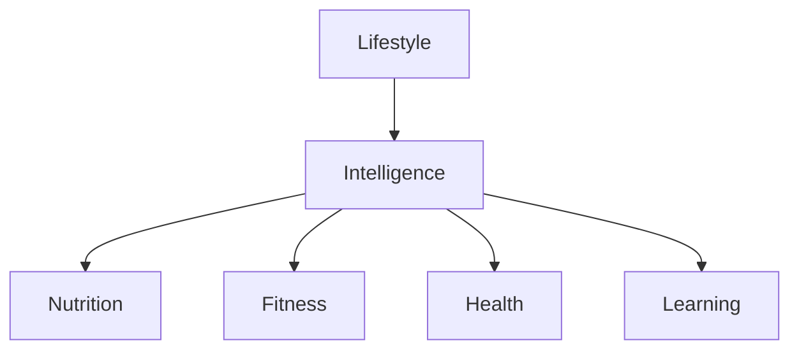

# Forge Domain Map

**Version:** 0.1  
**Status:** Draft  
**Owner:** Grant Groenewald  
**Contributors:** Grant Groenewald, ChatGPT

---

# Purpose

The Forge Domain Map provides the highest-level architectural view of Forge.

It illustrates the major domains that make up the product and the relationships between them.

This diagram is intended to help contributors understand the conceptual architecture of Forge before exploring the more detailed documentation.

---

# Domain Map

---

# Domain Responsibilities

## Lifestyle

Represents the user and their way of living.

Owns:

- Goals
- Objectives
- Preferences
- Budget
- Schedule
- Time Availability

---

## Intelligence

Represents Forge's understanding.

Responsible for:

- Learning
- Pattern recognition
- Recommendations
- Adaptation
- Context
- Memory

This domain connects every other domain.

---

## Nutrition

Owns:

- Recipes
- Meals
- Ingredients
- Pantry
- Grocery Lists
- Meal Plans

---

## Fitness

Owns:

- Exercises
- Workouts
- Training Sessions
- Programmes
- Equipment

---

## Health

Owns:

- Injuries
- Recovery
- Rehabilitation
- Health Constraints

---

## Learning

Owns:

- Lessons
- Tips
- Explanations
- Knowledge Topics
- Learning Paths

---

# Architectural Philosophy

Lifestyle provides context.

Intelligence provides understanding.

The remaining domains provide possible actions.

Recommendations emerge where understanding meets action.

---

# Guiding Statement

> Forge understands the user's lifestyle, applies intelligence, and recommends actions that support healthier, more balanced living.
